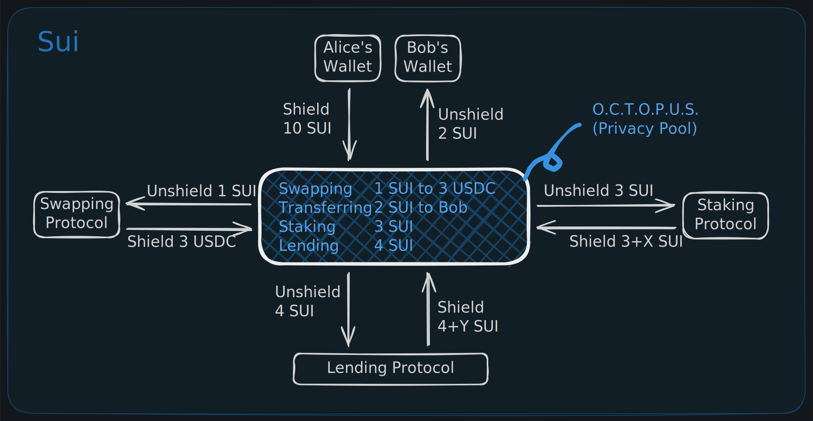
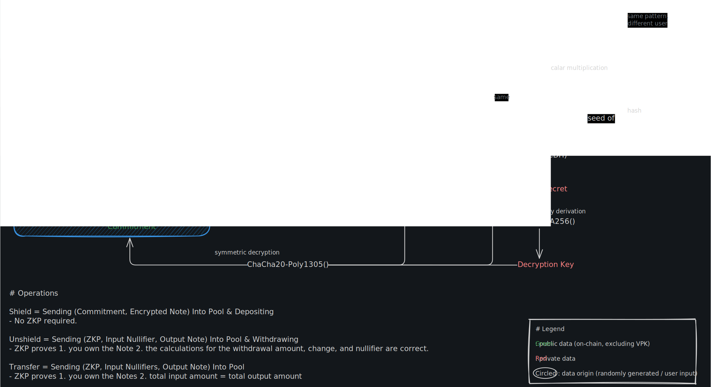

# Octopus - On-Chain Transaction Obfuscation Protocol Underlying Sui

**OCTOPUS** stands for **On-Chain Transaction Obfuscation Protocol Underlying Sui**.

A privacy protocol implementation for the Sui blockchain, enabling shielded transactions using zero-knowledge proofs.

[**ETHGlobal HackMoney 2026**](https://ethglobal.com/events/hackmoney2026)

## Overview



Octopus enables private token operations on Sui by implementing a UTXO-based privacy pool with Groth16 ZK-SNARKs verification. Users can:

- **Shield**: Deposit tokens into the privacy pool, creating encrypted notes
  - Shield = Sending (Commitment, Encrypted Note) Into Pool & Depositing
  - No ZKP required.
- **Unshield**: Withdraw tokens with ZK proof verification and automatic change handling
  - Sending (ZKP, Input Nullifier, Output Note) Into Pool & Withdrawing
  - ZKP proves
    1. you own the Note
    2. the calculations for the withdrawal amount, change, and nullifier are correct.
- **Transfer**: Send tokens privately to other users within the pool
  - Sending (ZKP, Input Nullifiers, Output Note) Into Pool
  - ZKP proves
    1. you own the Notes
    2. total input amount = total output amount
- **Swap**: Exchange tokens privately through integrated DEXs 🚧 **85% Complete** (DeepBook V3 Mainnet only)

### Cryptographic Primitives



```
MPK = Poseidon(spending_key, nullifying_key)   // Master Public Key
NSK = Poseidon(MPK, random)                    // Note Secret Key
commitment = Poseidon(NSK, token, value)       // Note Commitment
nullifier = Poseidon(nullifying_key, leaf_index) // Prevents double-spend
```

- **`Spending Key`**: A private key that proves ownership of a note and authorizes spending it. It must be kept secret.
- **`Nullifying Key`**: A private key used to generate a unique `nullifier` for each spent note, preventing double-spends. It must be kept secret.
- **`MPK (Master Public Key)`**: A public key derived from the spending and nullifying keys, serving as the root of a user's identity within the protocol.
- **`Viewing Key`**: A key that grants read-only access to transaction details. See the "Security Considerations" section for details on its two forms (personal vs. third-party).

## Quick Start

### Prerequisites

- [Sui CLI](https://docs.sui.io/guides/developer/getting-started/sui-install) >= 1.64.0
- [Node.js](https://nodejs.org/) >= 18
- [Circom](https://docs.circom.io/getting-started/installation/) >= 2.1.0

### 1. Build Circuits

```bash
cd circuits
npm install
./scripts/compile.sh
```

This generates for each circuit:

- `build/{circuit}_js/{circuit}.wasm` - Circuit WASM
- `build/{circuit}_final.zkey` - Proving key (9-10 MB)
- `build/{circuit}_vk.json` - Verification key

### 2. Build & Test Move Contracts

```bash
cd contracts
sui move build
sui move test
```

Expected output: **27 tests passing**

Reference [contracts/README.md](contracts/README.md) for deployment guides.

### 3. Build SDK (Required for Frontend)

```bash
cd sdk
npm install
npm run build
```

This generates the SDK TypeScript library that the frontend depends on.

### 4. Run Frontend (Web UI)

```bash
cd frontend
npm install
npm run dev
```

Open <http://localhost:3000> to access the web interface.

**Features:**

- **Multi-keypair management**: Store and switch between multiple privacy keypairs
- **Note scanning**: Background worker scans blockchain for your encrypted notes
- **Real-time balances**: Automatically computed from unspent notes
- **Shield/Unshield**: Deposit and withdraw with ZK proofs
- **Private transfers**: Send tokens to other users (2-input, 2-output) ✨
- **Swap UI**: Token exchange interface (awaiting DEX integration) 🚧

## Circuit Details

### Unshield Circuit (`unshield.circom`)

| Property | Value |
|----------|-------|
| Constraints | ~11,000 |
| Public Inputs | 1 (unshield_amount) |
| Public Outputs | 3 (nullifier, merkle_root, change_commitment) |
| Private Inputs | 8 (keys, note data, Merkle path, change_random) |
| Merkle Depth | 16 levels |

The circuit proves:

1. Knowledge of spending_key and nullifying_key (ownership)
2. Input note exists in Merkle tree
3. Correct nullifier derivation (prevents double-spend)
4. Balance conservation: `input_value = unshield_amount + change_value`
5. Correct change commitment computation (if change exists)

### Transfer Circuit (`transfer.circom`)

| Property | Value |
|----------|-------|
| Constraints | 21,649 |
| Public Inputs | 5 (merkle_root, nullifier_1, nullifier_2, commitment_1, commitment_2) |
| Private Inputs | 14 (2 input notes, 2 output notes, Merkle paths) |
| Transaction Model | 2-input, 2-output UTXO |

The circuit proves:

1. Ownership of 2 input notes (or 1 note + 1 dummy)
2. Input notes exist in Merkle tree
3. Correct nullifier derivation for spent notes
4. Balance conservation: `input_1 + input_2 = output_1 + output_2`
5. Valid output commitments for recipient and change notes

### Swap Circuit (`swap.circom`) 🚧 **In Progress**

> ⚠️ **DeepBook V3 is only available on Mainnet.** Swap functionality is currently limited to Mainnet deployments.

| Property | Value |
|----------|-------|
| Constraints | 22,553 |
| Public Inputs | 6 (merkle_root, 2 nullifiers, 2 commitments) |
| Private Inputs | 15 (input notes, output notes, swap params) |
| Status | Circuit complete, awaiting DeepBook integration |

The circuit proves:

1. Ownership and validity of input notes
2. Correct swap execution with slippage protection
3. Valid output notes (swapped tokens + change)

## Implementation Status

### ✅ Fully Implemented

- **Shield/Unshield**: Deposit and withdraw with ZK proofs
- **Private Transfers**: 2-input, 2-output UTXO model with recipient + change notes
- **Note Encryption**: ChaCha20-Poly1305 + ECDH for secure note storage
- **Multi-Keypair Management**: Store and switch between multiple privacy identities
- **Background Note Scanning**: Web Workers + GraphQL for non-blocking note discovery
- **Merkle Tree**: Incremental tree with 65,536 note capacity
- **Nullifier Registry**: On-chain double-spend prevention

### 🚧 In Progress (85% Complete)

- **Private Swaps**: Circuit and SDK complete, awaiting DeepBook integration
  - Mock 1:1 swap working in test environment
  - Production swap function scaffolded in contracts
  - Frontend UI complete with slippage protection

### 📋 Planned (Future Milestones)

- **Relayer Network**: Decentralized transaction broadcasting (Milestone 3)
- **Compliance Features**: Private Proofs of Innocence, view keys (Milestone 4)

## Security Considerations

- **MVP Simplifications**: This is a hackathon proof-of-concept
- **`Viewing Key`**: A key that grants read-only access to transaction details. In this project, it has two forms:
  - **Personal Viewing Key (Implemented)**: An encryption/decryption keypair is derived from the `spendingKey`. This allows the user to decrypt and view their own notes.
  - **Third-Party Viewing Key (Planned)**: A future feature will allow for a separate key to be shared with third parties (e.g., for compliance) for selective disclosure, without granting them spending authority.
  - Note encryption uses ChaCha20-Poly1305 (production-ready but needs key management review)
  - No EdDSA signature verification in circuits
- **For Production**:
  - Add explicit viewing key sharing mechanism
  - Implement EdDSA signature verification in circuits
  - Complete security audit of all cryptographic implementations
  - Add rate limiting and DoS protection

## Project Status

**Current Branch**: `fix/private-transfer`
**Last Updated**: February 3, 2026
**Overall Status**: 🟢 Highly Functional MVP

### Progress by Milestone

| Milestone | Status | Completion |
| --------- | ------ | ---------- |
| **Core Privacy (Shield/Unshield)** | ✅ Complete | 100% |
| **Milestone 1: Private Transfers** | ✅ Working | 95% |
| **Milestone 2: DeFi Integration (Swaps)** | 🚧 In Progress | 85% |
| **Milestone 3: Relayer Network** | ⏳ Planned | 0% |
| **Milestone 4: Compliance Features** | ⏳ Planned | 0% |

See [docs/](docs/) for detailed milestone documentation.

## License

MIT
